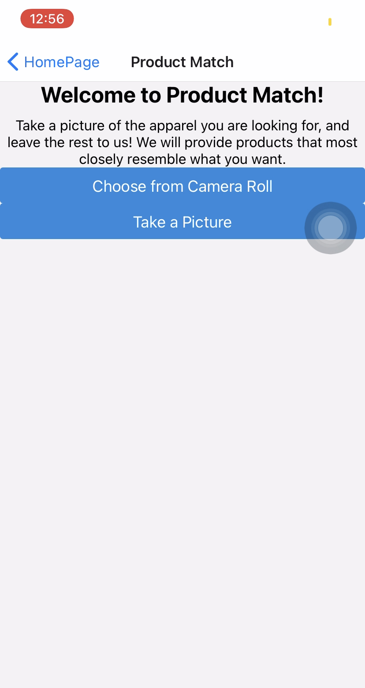
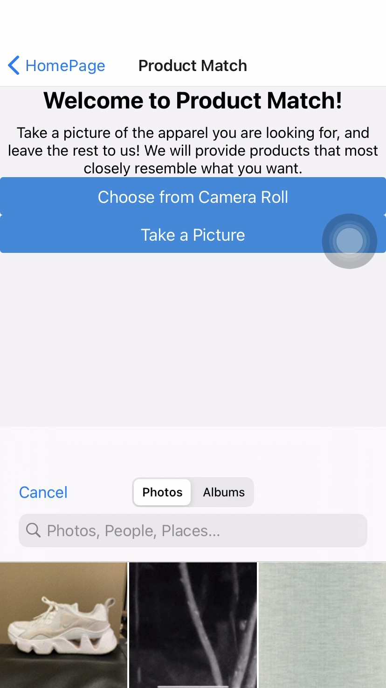
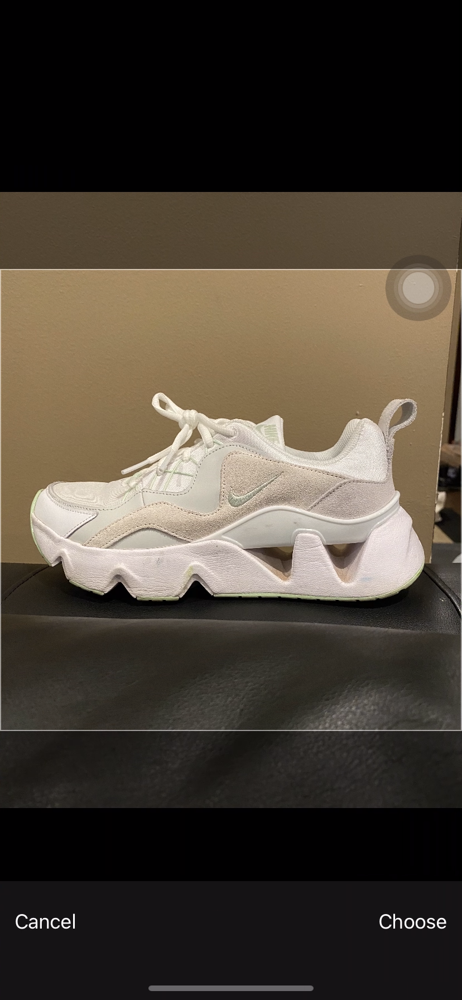
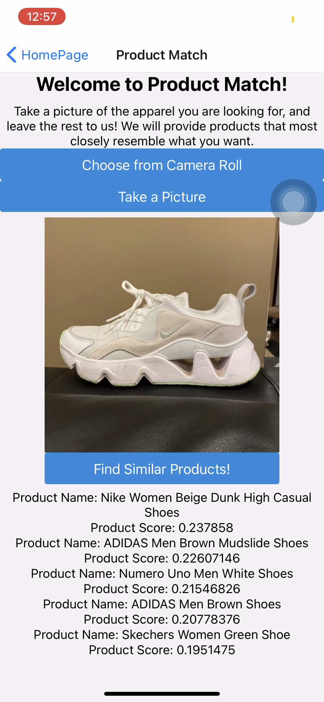

# CS98 Hack-a-Thing
## By: Divya Kopale, Ashley Song

### Ashley's Hacking:
Having some experience with react/react-native, I wanted to focus on a concept I wasn't familiar with. Recently, I've been interested in ML/AI application. After some initial research on how it was being used, I came across a short [report](https://tech.ebayinc.com/research/modanet-a-large-scale-street-fashion-dataset-with-polygon-annotations/) on the use of ML/AI in the online fashion/ecommerce industry. 
Using this as a source of inspiration, I looked into how I could do something similar. 
Although, much more basic than the most complex approaches/algorithms out there, I incorporated Google's Vision API to implement a basic "product matching" feature. 
This project more so taught me about an interesting application of ML concepts, data preparation, Google's ML products, and how to incorporate them into a mobile app. The next big goal is to implement ML algorithms on my own from scratch.

#### Difficulties:
Using Google's Vision API was a great learning experience, but it did limit the number of products/images I uploaded to a product set. As the free option only allowed 100 images, my dataset had to be cut down quite a lot. As with any ML application, a small dataset meant sacrificing accuracy. So, though the app works, the product matching accuracy would be greatly improved with a larger, more diverse dataset. 

Another difficulty was getting the batch csv file ready. It appears that data preparation is a time consuming aspect of ML.

#### Demo:

  

#### Tutorials Used:
* https://medium.com/@cwurthner/building-a-product-set-for-google-cloud-vision-product-search-ml-product-search-part-2-ba6ee9af46e
* https://cloud.google.com/vision/product-search/docs/searching#vision_product_search_get_similar_products-drest
* https://blog.jscrambler.com/create-a-react-native-image-recognition-app-with-google-vision-api/
* https://docs.expo.io/versions/latest/sdk/imagepicker/

#### Dataset Source:
* https://www.kaggle.com/paramaggarwal/fashion-product-images-small?

### Divya's Hacking:

## Running the App:
* `git clone`
* run `yarn` 
* run `expo start` to start the program
