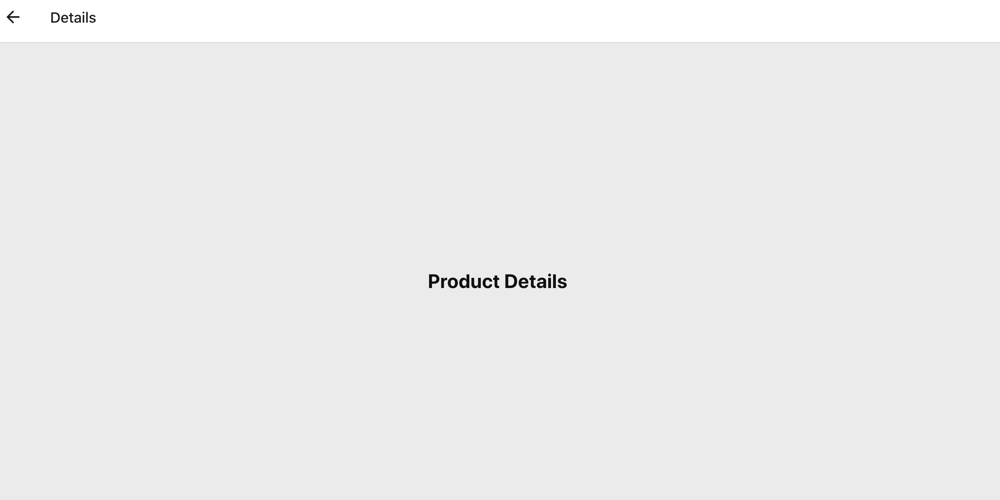
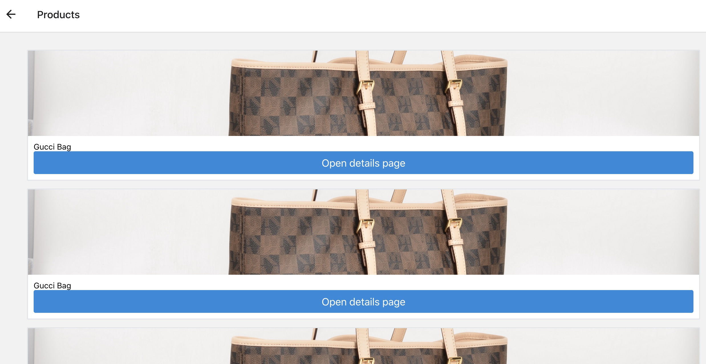

# CS98 Hack-a-Thing
## By: Divya Kopale, Ashley Song

### Ashley's Hacking:
Having some experience with react/react-native, I wanted to focus on a concept I wasn't familiar with. Recently, I've been interested in ML/AI application. After some initial research on how it was being used, I came across a short [report](https://tech.ebayinc.com/research/modanet-a-large-scale-street-fashion-dataset-with-polygon-annotations/) on the use of ML/AI in the online fashion/ecommerce industry. 
Using this as a source of inspiration, I looked into how I could do something similar. 
Although, much more basic than the most complex approaches/algorithms out there, I incorporated Google's Vision API to implement a basic "product matching" feature. 
This project more so taught me about an interesting application of ML concepts, data preparation, Google's ML products, and how to incorporate them into a mobile app. The next big goal is to implement ML algorithms on my own from scratch.

#### Difficulties:
Using Google's Vision API was a great learning experience, but it did limit the number of products/images I uploaded to a product set. As the free option only allowed 100 images, my dataset had to be cut down quite a lot. As with any ML application, a small dataset meant sacrificing accuracy. So, though the app works, the product matching accuracy would be greatly improved with a larger, more diverse dataset. 

Another difficulty was getting the batch csv file ready. It appears that data preparation is a time consuming aspect of ML.

#### Demo:

  

#### Tutorials Used:
* https://medium.com/@cwurthner/building-a-product-set-for-google-cloud-vision-product-search-ml-product-search-part-2-ba6ee9af46e
* https://cloud.google.com/vision/product-search/docs/searching#vision_product_search_get_similar_products-drest
* https://blog.jscrambler.com/create-a-react-native-image-recognition-app-with-google-vision-api/
* https://docs.expo.io/versions/latest/sdk/imagepicker/

#### Dataset Source:
* https://www.kaggle.com/paramaggarwal/fashion-product-images-small?

### Divya's Hacking:
Having no experience with react native, I wanted to take this time to really dive into how to build my own app from scratch. I first did research on what type of app I wanted to build and looked into what type of simulator I should use to test it. After deciding on an online store app I started following a navigation tutorial that used expo cli. I spent a lot of time looking through different tutorials a looking at how they structured react components. It was really beneficial to learn about how you can structure components in different ways and it became clear that some ways are much more efficient than others.

#### Difficulties:
I wanted to be able to create a product page that had a list of product cards and each card could navigate to a details page. I ended up manually writing each card component but if I were to continue to work on it I would want to create a template for this component and have a back end with data to produce multiple cards with just the data and the card component. I created a product matrix file that would read data into multiple product cards so different cards could be shown, but I wasn't ultimately able to get it up an running but I kept the file in the directory. In the end I think the structure of the components in a react app was something I should have spent more time on rather than just hacking away, I know next time how to differently approach a React App project and to spend more time defininf the relationship of components and making sure I can continue to modularize and I expand my project

#### Demo:

#### Tutorials Used:
*  https://heartbeat.fritz.ai/getting-started-with-stack-navigator-using-react-navigation-5-in-react-native-and-expo-apps-4c516becaee1
* https://codesource.io/e-commerce-app-with-react-native/
* https://medium.com/@SeoJaeDuk/react-native-tutorial-and-e-commerce-ef6c79f7977
* https://i-verve.com/blog/build-an-ecommerce-mobile-app-with-react-native

## Running the App:
* `git clone`
* run `yarn` 
* run `expo start` to start the program
